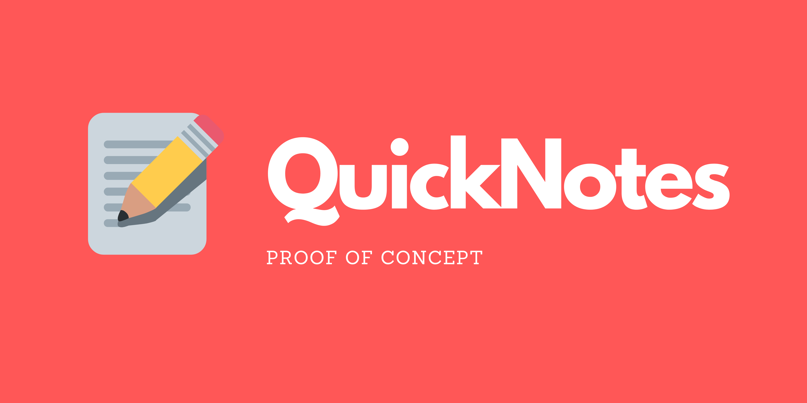

# 🌟 QuickNotes-API



**QuickNotes-API** is a simple and secure online notepad application. It allows users to create, edit, and delete private notes that are accessible anytime, anywhere. 

---

## 🚀 Features

- 🔒 **Authentication**: Secure login and registration system using JWT.
- 🗒️ **Private Notes**: Notes are private to each user and can be managed easily.
- ➕ **Add Notes**: Create as many notes as you like.
- ✏️ **Edit Notes**: Modify your notes effortlessly.
- 🗑️ **Delete Notes**: Remove notes you no longer need.

---

## 🛠️ Tech Stack

- 
- 
- 
- 

---

## 🌐 Local Setup

### Prerequisites

### Backend (API Server)

### Frontend (Angular Application)


---

## 📂 Project Structure

```plaintext
QuickNotes-API-JAVA
---

## 🖼️ Screenshots

👉 **Insert your screenshots here** to showcase the user experience and features.

- **Login Page**

- **Note Dashboard**

- **Edit Note Form**

---

## 📧 Contact

If you have any questions or need assistance, feel free to reach out!

---
## ✨ Author

- [Baptiste Moreau](https://github.com/BxptisteM)
